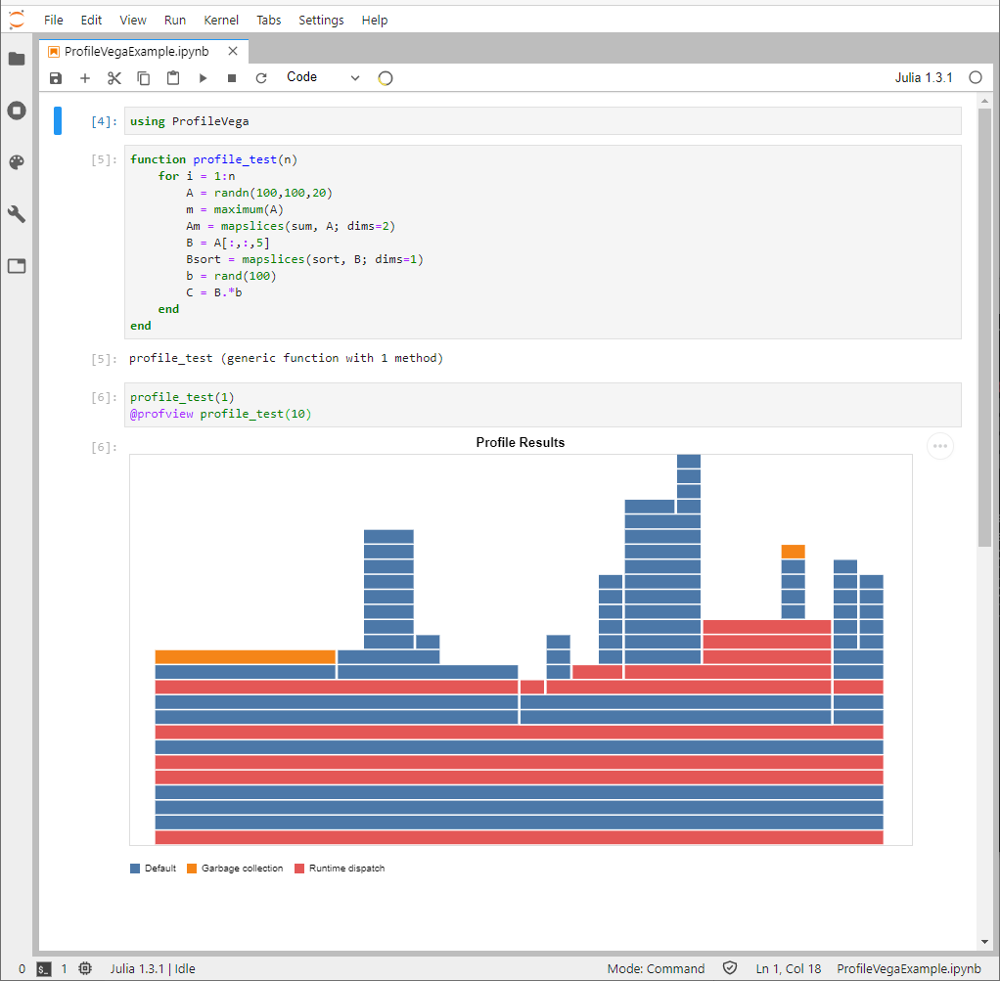

# ProfileVega

[](http://www.repostatus.org/#active)

[](https://codecov.io/gh/davidanthoff/ProfileVega.jl)


## Overview

ProfileVega allows you to export profiling data as a
[VegaLite.jl](https://github.com/queryverse/VegaLite.jl) figure. These
figures can be displayed in Jupyter/IJulia notebooks, or any other
figure display. It is essentially just an "export" package built on top of
[FlameGraphs](https://github.com/timholy/FlameGraphs.jl).

An alternative visualization package is the GTK-based
[ProfileView](https://github.com/timholy/ProfileView.jl).

Among the Julia packages, [ProfileView](https://github.com/timholy/ProfileView.jl)
currently has the most comprehensive tutorial on how to interpret a flame graph.

## Usage

### Usage in Jupyter

```julia
using ProfileVega
@profview f(args...)
```

where `f(args...)` is the operation you want to profile.
`@profview f(args...)` is just shorthand for

```julia
Profile.clear()
@profile f(args...)
ProfileVega.view()
```

If you've already collected profiling data with `@profile`, you can just call `ProfileVega.view()` directly.

The following screenshot illustrates Jupyter usage on a demonstration function `profile_test`:



You can hover over individual blocks in the flame graph to get more detailed information.

You can pan the picture via drag and drop, and zoom via your mouse wheel.

### Exporting figures

Even if you don't use Jupyter, you might want to export a flame graph as
a file as a convenient way to share the results with others. You can export
flame graphs created with this package as PNG, SVG, PDF, vega or vega-lite
files.

Here's a demonstration:

```julia
function profile_test(n)
    for i = 1:n
        A = randn(100,100,20)
        m = maximum(A)
        Am = mapslices(sum, A; dims=2)
        B = A[:,:,5]
        Bsort = mapslices(sort, B; dims=1)
        b = rand(100)
        C = B.*b
    end
end

profile_test(1)   # run once to compile

using Profile, ProfileVega
Profile.clear()
@profile profile_test(10);

# Save a graph that looks like the Jupyter example above
ProfileVega.view() |> save("prof.svg")
```
